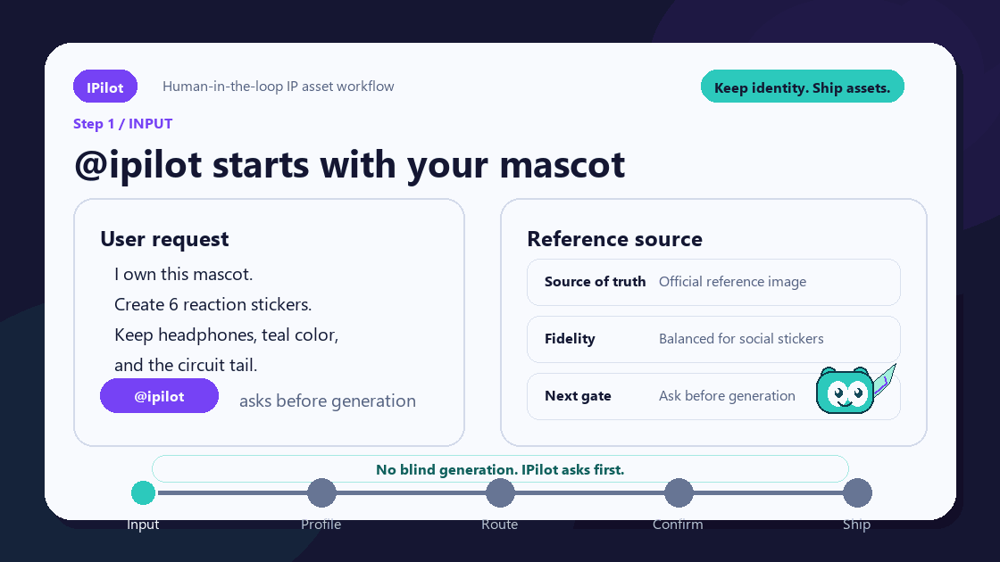

<p align="center">
  
</p>

<p align="center">
  <a href="README.md">English</a> · <a href="README.zh-CN.md">中文</a>
</p>

<p align="center">
  <a href="https://github.com/LewisHinton/IPilot/blob/main/LICENSE"></a>
  <a href="https://github.com/LewisHinton/IPilot/actions/workflows/validate.yml"></a>
  <a href="https://github.com/LewisHinton/IPilot/stargazers"></a>
</p>

# IPilot

Human-in-the-loop IP mascot asset workflow for agent Skills.

IPilot helps teams turn an existing mascot, avatar, brand figure, or IP character into consistent visual asset concepts: sticker packs, memes, campaign visuals, platform social posts, occasion-based visuals, physical material concepts, and image-generation prompt packs.

It is not a generic image generator. IPilot preserves the character's visual grammar first, then expands assets inside safe constraints.

## How to Install

Clone the repository:

```bash
git clone https://github.com/LewisHinton/IPilot.git
cd IPilot
```

Codex CLI / Codex editor / Codex desktop:

```bash
cp -R . ~/.codex/skills/ipilot
```

Windows PowerShell:

```powershell
Copy-Item -Recurse . "$env:USERPROFILE\.codex\skills\ipilot" -Force
```

Claude Code / Claude-compatible Skill runtimes:

1. Keep `SKILL.md` at the root of the `IPilot` folder.
2. Preserve `references/`, `templates/`, `examples/`, `sample_briefs/`, and `scripts/`.
3. Import, copy, symlink, or upload the folder according to your runtime's Skill mechanism.
4. If your runtime expects a portable bundle, zip the folder contents without changing structure.

Manual prompt-pack use:

1. Open `SKILL.md`.
2. Load the relevant files in `references/`.
3. Ask your model to follow IPilot for the current mascot project.

## Demo GIF

The demo shows IPilot's core loop: reference image -> consistency profile -> asset route -> user confirmation -> prompt pack and review notes before image generation.



## Quick Start

After installation, copy this into your agent:

```text
@ipilot
I already own this mascot. Treat the uploaded reference image as the official source of truth.

Goal: create a 6-piece reaction sticker pack for a community chat.
Keep fixed: silhouette, color ratio, line style, headphones, and circuit-tail identity.
You may vary: pose, expression, props, and short sticker captions.

First show me the IP Consistency Profile, the 6 sticker concepts, and the safety review.
Ask for confirmation before image generation.
```

What happens next:

| Step | IPilot does | You decide |
| --- | --- | --- |
| 1. Read the reference | Classifies the image role and extracts visual anchors. | Confirm or correct the fixed identity traits. |
| 2. Route the asset | Selects the sticker/community route and platform needs. | Accept the route or switch material type. |
| 3. Draft concepts | Separates captions, scenes, prompts, avoid rules, and safety notes. | Pick, revise, or remove concepts. |
| 4. Gate generation | Shows the final prompt pack before any image call. | Generate, revise, or reroute. |

## Why Star This

IPilot solves a common production failure: teams have a recognizable character, but every new prompt slowly changes its identity.

It gives agent runtimes a repeatable workflow for:

- keeping reference-image fidelity instead of silently averaging visual references;
- separating invariant features, flexible features, forbidden changes, and safety constraints;
- routing requests into the right material type before generating details;
- adapting output for platforms, occasions, audiences, and physical usage contexts;
- keeping the user in the loop with short recaps, micro-confirmations, and approval gates;
- separating captions, visual prompts, text-layout notes, safety notes, and production handoff notes.

## Core Workflow

```text
Guided IP intake
-> Reference image intake, if references exist
-> IP consistency profile
-> Deep visual consistency profile
-> Material type routing
-> Human confirmation gate
-> Asset concepts
-> Safety and consistency review
-> Image generation or prompt handoff
-> Post-generation review
-> Text layout and production handoff
```

## Human-in-the-Loop by Default

- Gate 0: material type confirmation.
- Gate 1: asset direction confirmation.
- Gate 2: concept approval before image generation.
- Gate 3: post-generation accept / revise / regenerate decision.

## Ecosystem Support

| Environment | Install / Use |
|---|---|
| Codex CLI | copy to `~/.codex/skills/ipilot` |
| Codex editor / desktop | copy to the Codex skills directory or install as a workspace Skill |
| Claude Code and similar CLI agents | import, copy, symlink, or point the agent at the folder |
| Claude app / web Skill flows | upload or import a zipped Skill folder when supported |
| Other SKILL.md-compatible agents | preserve folder structure and point the agent at `SKILL.md` |
| No Skill runtime | manually load `SKILL.md` plus relevant `references/` files |

## Application Domains

| Domain | Typical Outputs |
|---|---|
| Brand marketing | campaign cards, launch visuals, social covers |
| Community operations | reaction stickers, welcome stickers, contributor badges |
| Education and campus orgs | workshop stickers, exam-season cards, explainer thumbnails |
| Open-source projects | mascot stickers, README banners, release celebration cards |
| Events and conferences | booth posters, badges, flyers, attendee stickers |
| Physical merchandise | sticker sheets, keychains, postcards, packaging inserts |
| Occasion campaigns | IP birthday visuals, holiday greetings, anniversary cards |
| Consistency review | generated-image QA, reference conflict resolution |

## Validate a Brief

```bash
python scripts/validate_ip_brief.py sample_briefs/tensor-cat-brief.md
python scripts/check_release_readiness.py
```

## 中文版

完整中文首页请看 [README.zh-CN.md](README.zh-CN.md)。

## Safety Boundaries

IPilot must not generate or recommend hateful, sexualized, political-persuasion, harassing, copyrighted-character imitation, or user-forbidden content.

## Community and Trust

- Use `CONTRIBUTING.md` before opening pull requests.
- Use GitHub issue templates for bugs, feature requests, and real-world use cases.
- Use `SECURITY.md` for prompt-injection, unsafe-instruction, or script-behavior concerns.
- Do not upload private reference art, brand guidelines, or unreleased mascot assets unless you have rights to share them.

## GitHub Release Checklist

- Confirm `LICENSE` matches the intended open-source license.
- Add repo description: `Human-in-the-loop IP mascot asset workflow for agent Skills`.
- Use topics: `codex-skill`, `mascot`, `brand-safety`, `image-generation`, `prompt-engineering`, `human-in-the-loop`, `ip-consistency`, `creative-ai`.
- Keep GitHub Actions validation enabled.
- Run `python scripts/check_release_readiness.py`.

## Status

Current release: **v0.8 release candidate**.
